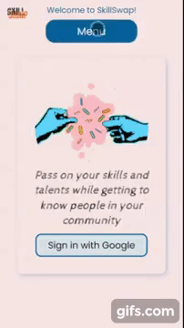
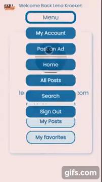
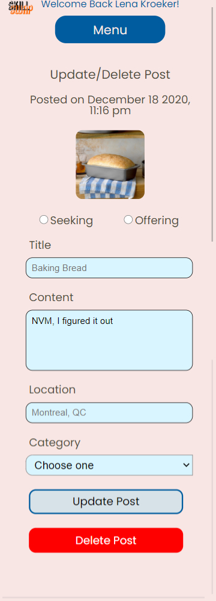

# skill_swap
Final project - Skill Swap
cb_fw_20

An app where users can sign up and post ads for skills they would like to swap with others in their community.

Technologies Used:

React JS
Node JS
Styled Components
Firebase Realtime Database
Firebase Storage
NPM

1. Users sign in using their google account and are redirected to the "all posts" page. Users who are not signed in are able to view all posts page and search, as well as view post details pages.

2. Signed-in Users can create posts including category criteria and upload an image

3. Signed-in Users can view/update/delete their posts in the 'My Posts' area of 'My Account'

4. Signed-in Users can view their favorite posts in 'My Favorites' area of 'My Account'

5. Signed-in Users can reply to a post from post details page or post details in favorites

7. Signed-in Users recieve messages sent in response to their posts in the 'My Messages' area of 'My Account'. They can then chose to respond by email.

8.  Signed-in Users can sign out using the dropdown menu, and are redirected to the home page

